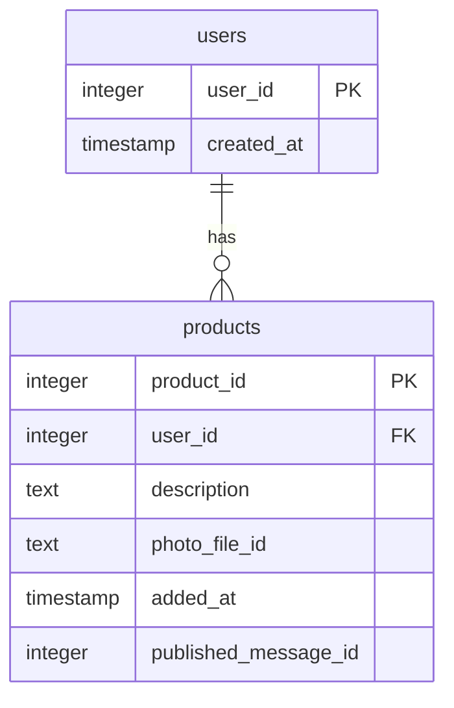

# 🛍️ Telegram Shop Bot

[](https://www.python.org/)
[](https://docs.aiogram.dev/)
[](LICENSE)

Telegram Shop Bot - это полнофункциональный бот для создания интернет-магазина в Telegram. Бот позволяет пользователям добавлять товары с описанием и фотографиями, просматривать каталог, искать товары, а также автоматически публикует новые товары в Telegram-канале.


## 🌟 Основные возможности

- 📝 Добавление товаров с описанием и фотографиями
- 🔍 Поиск товаров по описанию
- 📚 Интерактивный каталог с постраничной навигацией
- 📢 Автоматическая публикация товаров в Telegram-канале
- 👤 Личный кабинет с управлением своими товарами
- ⚙️ Административные инструменты для управления магазином
- 💾 Хранение данных в SQLite базе данных

## 🚀 Установка и запуск

### Предварительные требования
- Python 3.10 или выше
- Telegram бот (получить токен от [@BotFather](https://t.me/BotFather))
- Telegram канал (для публикации товаров)

### Установка

1. Клонируйте репозиторий:
```bash
git clone https://github.com/yourusername/telegram-shop-bot.git
cd telegram-shop-bot
```

2. Установите зависимости:
```bash
pip install -r requirements.txt
```

3. Заполните файл конфигурации `app/config.py`:
```python
BOT_TOKEN = 'your bot token'
ADMIN_ID='your admin id'
CHANNEL_ID = 'your channel id'
```

4. Запустите бота:
```bash
python bot.py
```

## 📖 Команды бота

### Для пользователей
| Команда          | Описание                              |
|------------------|---------------------------------------|
| `/start`         | Начать работу с ботом                 |
| `/add`           | Добавить новый товар                  |
| `/catalog`       | Просмотреть каталог товаров           |
| `/search`        | Поиск товаров по описанию             |
| `/my_products`   | Просмотреть и управлять своими товарами |

### Для администратора
| Команда          | Описание                              |
|------------------|---------------------------------------|
| `/sync_channel`  | Синхронизировать канал с базой данных |

## 🗺️ Roadmap

### Версия 1.0 (Current)
- [x] Регистрация пользователей
- [x] Добавление товаров
- [x] Постраничный каталог
- [x] Поиск по описанию
- [x] Автоматическая публикация в канал
- [x] Управление своими товарами
- [x] Синхронизация канала

### Версия 1.1
- [ ] Система заказов
- [ ] Корзина пользователя
- [ ] Платежная интеграция
- [ ] Категории товаров
- [ ] Система рейтингов и отзывов

### Версия 2.0
- [ ] Веб-панель администратора
- [ ] Мобильное приложение
- [ ] Система аналитики
- [ ] Интеграция с CRM

## 🧾 Документация

### Структура базы данных


### Файловая структура проекта
```
telegram-shop-bot/
├── bot.py                # Основной файл бота
├── databse.py            # База данных
├── config.py             # Конфигурация
├── hendlers              # Хендлеры
├── tgk                   # Модуль свзянный с телеграмм каналом
└── keyboard              # Клавиатура
```

## 🛠️ Технологии

- **Python** - основной язык программирования
- **Aiogram** - фреймворк для создания Telegram ботов
- **SQLite** - база данных для хранения информации
- **Asyncio** - асинхронное программирование

## 🤝 Как внести вклад

1. Форкните репозиторий
2. Создайте ветку для вашей фичи (`git checkout -b feature/amazing-feature`)
3. Зафиксируйте изменения (`git commit -m 'Add some amazing feature'`)
4. Запушьте ветку (`git push origin feature/amazing-feature`)
5. Откройте Pull Request

## ✉️ Контакты

Если у вас есть вопросы или предложения, пишите:
- Email: offconix@gmail.com
- Telegram: @onixed

---

**Telegram Shop Bot** © 2025 - Простой и функциональный магазин в Telegram!